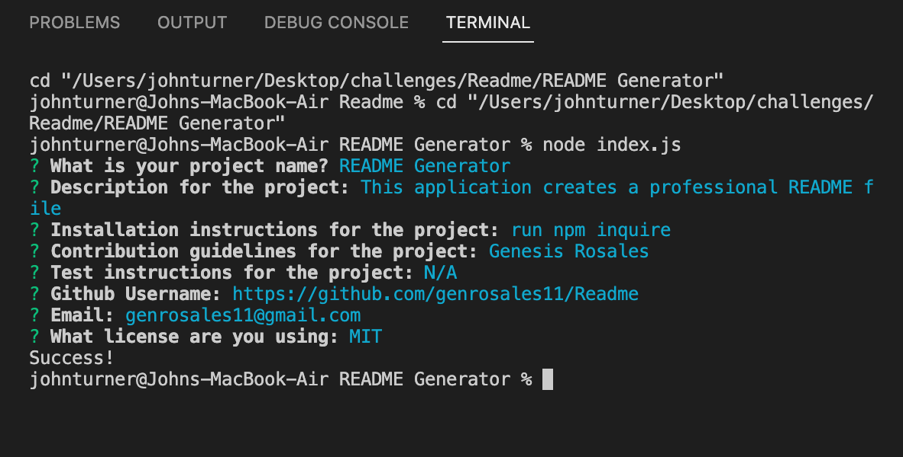

    # undefined
    #### Github: undefined
   Video https://drive.google.com/file/d/1ZLZb9HQn3iHuiIaAOPExyzabyC1WqNZk/view?usp=sharing
   

    ### Screenshot of end product:
    

    ## Table of Contents

    1. [Github](#github)

    2. [Email](#email)

    3. [Description](#description)

    4. [License](#license)

    5. [Install](#install)

    6. [Testing](#test)

    7. [Repo](#repo)

    8. [Contribution](#contribution)
       
    ## Description: 
    This application will generate a README file
            
    ## Installation commands required:
    Use the following code in your code for installation:
    ```    
    - undefined
    ```
    ## Testing information
    N/A
    ## Repo
    undefined
    ##### Licensed with:
    [](https://opensource.org/licenses/MIT)
    ## Contributor:
    Genesis Rosales
    ## Email
    You can contact the creator with questions regarding the generator at genrosales11@gmail.com
    